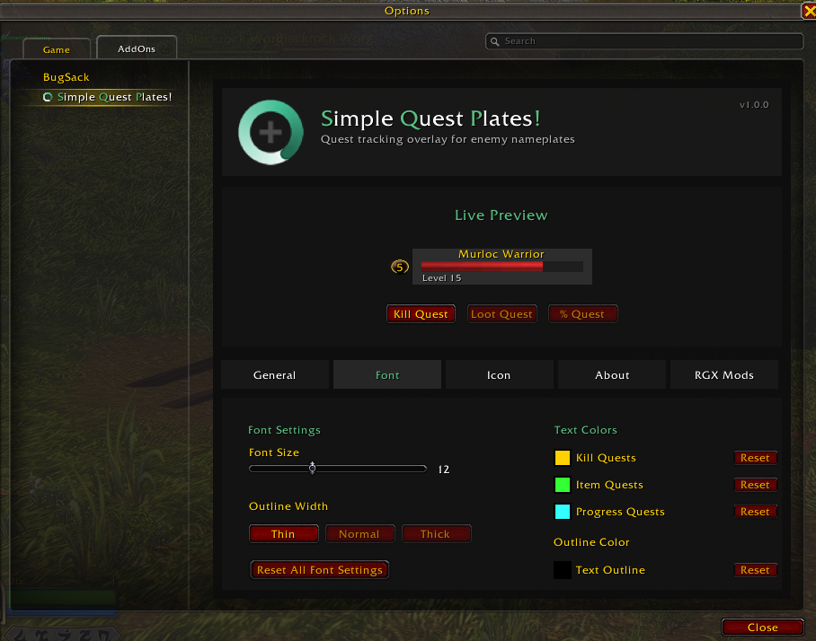

#  SQP | Simple Quest Plates!
##  RGX Mods - [RealmGX](https://realmgx.com) Community Project

### 🌟 Join the  RealmGX Community - Gamers eXtreme! 🌟

### 🎯  *See quest progress at a glance on enemy nameplates!* 🎯

**SQP is a professional World of Warcraft addon that displays quest progress icons directly on enemy nameplates with extensive customization options.**

**🎮  Connect with fellow questers, get support, and be part of the RGX Mods family!**

---

<!-- GitHub Stats & Badges -->

<!-- Platform Badges -->

<!-- WoW Compatibility -->

[Features](#features) • [Quick Start](#quick-start) • [Commands](#command-reference) • [Compatibility](#compatibility) • [Installation](#installation) • [Support](#support)

---

## 🌟 Join the  RGX Mods Community!

### 💬  RealmGX Discord - Your Gaming Home!

**🎮  [Realm  Gamers eXtreme](https://realmgx.com) - Where WoW Enthusiasts Unite!**

**✨ What awaits you in our Discord:**
- 🛠️ **Instant addon support** from the RGX Mods team
- 🎯 **Feature requests** and direct dev communication
- 🚀 **Beta testing** opportunities for new releases
- 🤝 **Community of WoW players** sharing tips and experiences
- 📢 **First to know** about new RGX Mods releases
- 🎉 **Events, giveaways**, and community activities

**⚠️ WARNING:** May cause you to prioritize questing over literally everything else.

**The Kiwi Says:** "Bwwiiiee."

---

## 💖 Support  RGX Mods

**Your support helps keep RGX Mods alive and constantly improving!**

| | |
|---|---|
|  |  |
|  |  |

_Every donation helps fund new features and improvements!_

---

## 🎯 What is SQP?

**SQP | Simple Quest Plates!** enhances your World of Warcraft experience by displaying quest progress icons directly on enemy nameplates. Know at a glance which enemies you need to defeat for your quests, how many items they drop, and your overall progress — all without cluttering your interface.

### 🔥 Why Choose SQP?
- **🎯 Quest Awareness:** See quest-relevant enemies at a glance without checking your quest log
- **🎨 Fully Customizable:** Adjust colors, fonts, sizes, and positions to your liking
- **⚡ Lightweight:** Efficient caching system with minimal performance impact
- **🌍 Multi-Language:** Supports all major WoW locales with full fallback coverage
- **💬 Active Support:** Join our Discord for instant help!

---

## ✨ Features

| Feature | Description |
|---------|-------------|
| 🎯 **Quest Icons** | Display quest progress directly on enemy nameplates |
| 🎨 **Fully Customizable** | Adjust colors, fonts, sizes, and positions |
| 📊 **Item Priority** | Shows item counts before kill counts when both are needed |
| 🌍 **Multi-Language** | Supports all major WoW locales with full fallback coverage |
| ⚡ **Lightweight** | Minimal performance impact with efficient caching |
| 🛡️ **Combat Options** | Hide icons during combat or in instances |
| 🎨 **Live Preview** | See changes in real-time in the options panel |
| 🎯 **Smart Detection** | Automatically tracks all active quests in your area |
| 🔧 **Position Control** | Place icons on left or right side with X/Y offsets |
| 🎨 **Font Customization** | Size, outline style, and shadow effects |
| 🌈 **Color Options** | Different colors for kill, item, and progress quests |
| 🖼️ **Icon Tinting** | Optional icon color tinting |
| 💾 **Account-Wide** | Settings saved across all characters |
| 🛡️ **Error-Free** | Comprehensive error handling |
| 🔍 **Slash Commands** | Quick access to all features |

---

## 🌍 Localization

SQP automatically detects your game language and supports:

| | | | |
|---|---|---|---|
| English (enUS) | English EU (enGB) | Deutsch (deDE) | Español (esES/esMX) |
| Français (frFR) | Italiano (itIT) | 한국어 (koKR) | Português Brasil (ptBR) |
| Русский (ruRU) | 简体中文 (zhCN) | 繁體中文 (zhTW) | |

_Want to help translate? Join our Discord or visit [RealmGX](https://realmgx.com)!_

---

## 🚀 Quick Start

1. **Install** SQP from your preferred platform
2. **Launch** World of Warcraft
3. **Type** `/sqp` to open the options panel
4. **Customize** your quest display preferences
5. **Quest** with enhanced awareness!

---

## 📋 Command Reference

Use `/sqp` followed by:

| Command | Description |
|---------|-------------|
| `/sqp` or `/sqp options` | Open the options panel |
| `/sqp help` | Display all available commands |
| `/sqp on` | Enable the addon |
| `/sqp off` | Disable the addon |
| `/sqp status` | Show current settings |
| `/sqp version` | Show addon version |
| `/sqp test` | Test quest detection on current nameplates |
| `/sqp scale <0.5-2.0>` | Set icon scale |
| `/sqp offset <x> <y>` | Set icon position offset |
| `/sqp anchor <LEFT\|RIGHT>` | Set which side of nameplate to anchor to |
| `/sqp reset` | Reset all settings to defaults |
| `/sqp debug` | Toggle debug mode |

---

## 📋 Compatibility

| WoW Version | Interface | Status |
|-------------|-----------|--------|
| **Retail Midnight** | `120000`, `120001` | ✅ Fully Supported |

---

## 📥 Installation

1. **Download** from your preferred platform:
   - [CurseForge](https://www.curseforge.com/wow/addons/simple-quest-plates)
   - [Wago.io](https://addons.wago.io/addons/simple-quest-plates)
   - [WoWInterface](https://www.wowinterface.com/downloads/info26957-SimpleQuestPlates.html)
   - [GitHub](https://github.com/donniedice/SimpleQuestPlates/releases)

2. **Extract** to your WoW AddOns directory:
   - **Retail**: `World of Warcraft/_retail_/Interface/AddOns`

3. **Restart** WoW and configure with `/sqp`

---

## 🆕 What's New

_See [docs/CHANGES.md](./docs/CHANGES.md) for the full release history and latest updates._

---

## 🛠️ Configuration Tips

<table width="100%">
<tr>
<td width="50%" valign="top">

### Recommended Settings:
- **Combat Players:** Enable "Hide in Combat" for cleaner fights
- **Dungeon/Raid:** Enable "Hide in Instances" to reduce clutter
- **Questing Focus:** Larger scale (1.5x) and bright colors for maximum visibility
- **Minimalist:** Smaller scale (0.8x) with subtle positioning

### Customization Options:
- **Icon Scale:** 0.5x to 2.0x size adjustment
- **X/Y Offset:** -50 to +50 pixel positioning
- **Anchor Side:** Left or right side attachment
- **Font Size:** 8 to 20 point with outline and shadow options
- **Color Options:** Different colors for kill, item, and progress quests

</td>
<td width="50%" valign="top">

### How It Works:
- SQP uses Blizzard's quest API to detect which enemies are related to your active quests
- Automatically scans all nameplates in view
- Updates in real-time as you accept or complete quests
- Prioritizes item drops over kill counts for dual-objective quests

### Performance:
- Efficient caching system for quest data
- Minimal CPU usage with smart update cycles
- No impact on frame rates

</td>
</tr>
</table>

---

## 🐛 Known Issues

- No known issues at this time. Report any problems via [GitHub Issues](https://github.com/donniedice/SimpleQuestPlates/issues) or our [Discord](https://discord.gg/N7kdKAHVVF).

---

## 🔧 Troubleshooting

**Quest icons not showing?**
- Use `/sqp test` to verify quest detection on current nameplates
- Check if "Hide in Combat" or "Hide in Instances" is enabled via `/sqp status`
- Confirm the addon is enabled with `/sqp on`

**Settings not applying?**
- Enable Debug Mode with `/sqp debug` for detailed logging
- Reset all settings to defaults with `/sqp reset`

**Still having trouble?**
- Join our [Discord](https://discord.gg/N7kdKAHVVF) for instant support
- Open a [GitHub Issue](https://github.com/donniedice/SimpleQuestPlates/issues)

---

## 🤝 Contributing

Contributions are welcome! Feel free to:
- 🐛 **Report bugs** via [GitHub Issues](https://github.com/donniedice/SimpleQuestPlates/issues)
- 💡 **Suggest features** in our [Discord](https://discord.gg/N7kdKAHVVF)
- 🌍 **Help with translations** for global players
- ⭐ **Star the repository** to show your support

---

## 📄 License

This project is licensed under the [MIT License](https://github.com/donniedice/SimpleQuestPlates/blob/main/LICENSE).

---

### 🌟 Thank you for choosing  RGX Mods! 🌟

**Made with ❤️ by the [RealmGX](https://realmgx.com) Community**
**Lead Developer:** [DonnieDice](https://github.com/donniedice)

_"Quest smarter, not harder."_

**⚠️ WARNING:** May cause you to prioritize questing over literally everything else.

**The Kiwi Says:** "Bwwiiiee."

---

### Part of the RGX Mods Collection

[BLU](https://github.com/donniedice/BLU) | [BLU Classic](https://github.com/donniedice/BLU_Classic) | [CCU](https://github.com/donniedice/CoordinationCloakUtility) | [FFLU](https://github.com/donniedice/FinalFantasyLevelUp) | [PetBuddy2](https://github.com/donniedice/PetBuddy2) | [RND](https://github.com/DonnieDice/RemoveNameplateDebuffs) | [SRLU](https://github.com/donniedice/SkyrimLevelUp)

** RGX Mods - Powered by [RealmGX](https://realmgx.com) Community**

